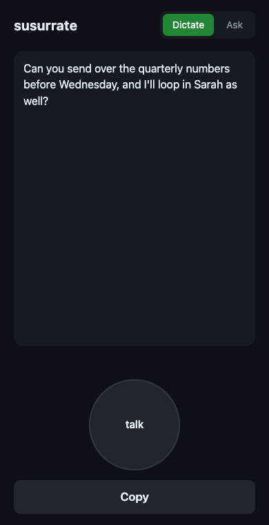

# susurrate

Local, private Wispr Flow-style voice dictation for macOS. Hold a hotkey
anywhere, speak, release — cleaned-up text is inserted at your cursor.
Everything runs on-device: whisper.cpp for speech-to-text, optional Ollama
for AI polish. No cloud, no accounts.

<p align="center">
  
</p>

<p align="center"><sub>The phone web app, real output: the "um"s stripped and a
mid-sentence correction applied ("before Thursday — no wait, before Wednesday").</sub></p>

## Why not just use the built-in dictation?

- **The polish.** Built-in dictation gives you the messy first pass, filler
  words and all. susurrate strips the "um"s, fixes punctuation, and applies
  spoken self-corrections — text you can send without editing.
- **Your voice never leaves hardware you own.** Speech is transcribed on your
  Mac by whisper.cpp. Nothing uploaded, no account, no logging you don't control.
  (Wispr Flow, the paid tool this clones, sends your audio to its servers.)
- **It's yours.** A token-guarded HTTP endpoint any script, hotkey, or Shortcut
  can call, plus a personal dictionary you teach. Free, ~1000 lines of Python.

## Setup

Requirements: macOS, [Homebrew](https://brew.sh), [uv](https://docs.astral.sh/uv/).
Optional: [Ollama](https://ollama.com) with `llama3.2:3b` for the `--llm`
polish pass.

```sh
brew install whisper-cpp ffmpeg     # speech-to-text + audio decoding
git clone https://github.com/jdanzig/susurrate && cd susurrate
uv sync

# download the speech model (~141 MB, one-time)
mkdir -p ~/.local/share/susurrate/models
curl -L -o ~/.local/share/susurrate/models/ggml-base.en.bin \
  https://huggingface.co/ggerganov/whisper.cpp/resolve/main/ggml-base.en.bin
```

(ffmpeg is only needed for remote mode, to decode uploaded m4a clips.)

## macOS permissions

Grant these to the app you run susurrate from (Terminal, iTerm, …) in
System Settings → Privacy & Security:

| Permission | Needed for |
|---|---|
| Microphone | recording your voice |
| Input Monitoring | the global hold-to-talk hotkey |
| Accessibility | auto-pasting into the focused app |

Without Accessibility, susurrate still works: it leaves the text on your
clipboard and shows a notification so you can ⌘V yourself.

## Usage

```sh
uv run susurrate run              # daemon: hold right-Option to dictate
uv run susurrate run --key f13    # different hotkey (alt_r, alt_l, cmd_r, ctrl_r, f13–f15)
uv run susurrate --llm run        # add local-LLM cleanup (self-corrections, tone)
uv run susurrate once --seconds 5 # record once, print the transcript
uv run susurrate file audio.wav   # transcribe a 16 kHz mono WAV
```

Hold the hotkey, speak, release. The transcript is cleaned (fillers stripped,
punctuation fixed), pasted at your cursor, and logged to
`~/.local/share/susurrate/history.jsonl`. Your previous clipboard is restored.
Audio recordings are deleted as soon as they're transcribed.

## Remote mode: your own dictation cloud

Run the pipeline on an always-on machine (say, a Mac mini on your
[Tailscale](https://tailscale.com) tailnet) and dictate to it from anywhere:

```sh
uv run susurrate serve    # on the always-on machine
```

The server binds to your Tailscale IP by default (falling back to
127.0.0.1) and generates a bearer token on first run — it prints both, and
the token lives in `~/.local/share/susurrate/token`. One endpoint:
`POST /dictate` with an audio clip as the request body — WAV, m4a,
anything ffmpeg can read. Optional query params: `llm=1` for the Ollama
polish pass, `paste=1` to paste the result into the *server's* frontmost app
(off unless started with `--allow-paste`). Uploaded audio is deleted after
transcription, same as local recordings.

**From another Mac** — same hotkey experience, no models needed locally:

```sh
SUSURRATE_TOKEN=<token> uv run susurrate --remote http://100.x.y.z:8737 run
```

**From a phone** — susurrate serves its own one-button web app at `GET /`.
Phones only allow microphone access over HTTPS, so put Tailscale's built-in
HTTPS proxy in front:

1. In the [Tailscale admin console](https://login.tailscale.com/admin/dns),
   enable **HTTPS Certificates** (one-time, whole tailnet).
2. On the server machine, bind susurrate to localhost and front it with
   `tailscale serve`:

   ```sh
   uv run susurrate serve --host 127.0.0.1
   tailscale serve --bg --https=443 http://127.0.0.1:8737
   ```

3. On the phone (Tailscale connected): open
   `https://<machine>.<tailnet>.ts.net` in the browser, paste the token when
   asked (remembered from then on), allow the microphone, and use
   **Share → Add to Home Screen** to make it a full-screen app.

Tap, talk, tap: the cleaned text appears and is copied to the clipboard,
ready to paste. The first HTTPS request takes ~15 s while the certificate is
issued; after that it's instant.

### Teach it your words

Whisper mishears names and jargon — "susurrate" comes out "Sesarite". In the
web app's **Dictate** mode the result is editable: fix the word, tap **Save
fixes**, and the correction is stored and applied to every future dictation
(both as a whisper hint and a substitution). It only learns genuine
transcription fixes — editing a real word to another real word (changing your
mind) is ignored, so the dictionary doesn't fill with noise. Corrections live
in `~/.local/share/susurrate/dictionary.json`; edit or delete it directly any
time.

Prefer no web app? An Apple Shortcut works too: **Record Audio** →
**Get Contents of URL** (POST to `/dictate?llm=1`, header
`Authorization: Bearer <token>`, Request Body → File → Recorded Audio) →
**Get Value for** `text` → **Copy to Clipboard**.

Plain `curl` works too:

```sh
curl -X POST -H "Authorization: Bearer $TOKEN" \
  --data-binary @clip.m4a "https://<machine>.<tailnet>.ts.net/dictate?llm=1"
```

## Run it as a service (launchd)

`contrib/com.jondanzig.susurrate.plist` is a template LaunchAgent (edit the
paths/username). Install with:

```sh
cp contrib/com.jondanzig.susurrate.plist ~/Library/LaunchAgents/
launchctl bootstrap gui/$(id -u) ~/Library/LaunchAgents/com.jondanzig.susurrate.plist
```

It starts at login, restarts on crash, and logs to
`~/.local/share/susurrate/serve.log`.

## How it compares

**vs [Wispr Flow](https://wisprflow.ai/):** same core loop (hotkey → speak →
polished text at cursor), but 100% local and free. Not (yet) included:
command mode, per-app tone, menu-bar UI, streaming transcription. See
[PLAN.md](PLAN.md).

**vs [OpenSuperWhisper](https://github.com/starmel/OpenSuperWhisper):** if you
want a polished native dictation app, use that — it has a real UI, in-app
model management, multilingual auto-detection, and a mic picker. What it
doesn't have is the part that makes Wispr Flow feel different from plain
dictation: a formatting pass between transcript and paste. Susurrate strips
fillers and false starts, fixes punctuation, and can apply spoken
self-corrections ("Tuesday — no wait, Wednesday" → "Wednesday") through a
local LLM via [Ollama](https://ollama.com). [Superwhisper](https://superwhisper.com/)
has a similar AI layer, but it's closed-source and paid.

Susurrate is deliberately small: under 1000 lines of Python across eight
modules, meant as a hackable base for experimenting with the
transcript→clean-text stage (prompts, models, rules).

## Development

```sh
uv run python -m unittest discover -s tests
```
